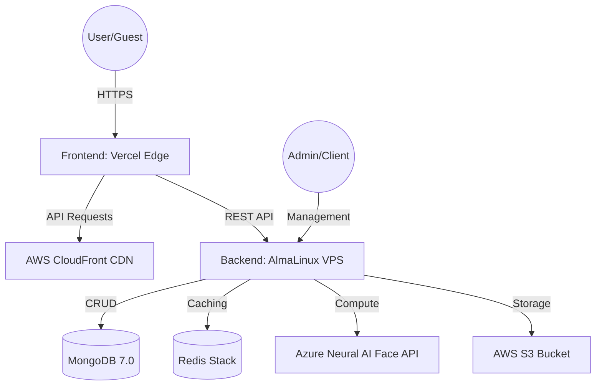

# 💎 DP Face Scan App: Master Blueprint

This document provides the full technical architecture, dependency map, and portability guide for the DP Face Scan App. Use this blueprint to replicate, migrate, or rebuild the system from any source.

---

## 🏗️ 1. High-Level Architecture
The system follows a modern decoupled architecture designed for high-concurrency photo processing.



---

## 🛠️ 2. Core Technology Stack

### **Frontend**
- **Framework**: React 18+ with Vite
- **Styling**: Vanilla CSS (Premium Black & Gold Theme)
- **Animations**: Framer Motion
- **Icons**: Lucide React
- **Deployment**: Vercel (Auto-scaling Edge)

### **Backend**
- **Run-time**: Node.js 20.x
- **Framework**: Express.js
- **Database**: MongoDB (7.0 recommended)
- **Cache/Queue**: Redis (for large photo set generation)
- **Process Manager**: PM2

### **Services**
- **Facial Recognition**: Azure AI Face (Neural Matching)
- **Assets**: AWS S3 + CloudFront (HTTPS optimized)

---

## 🚀 3. Portability & Migration Guide
Follow these steps to run the app from a clean, new source.

### **Step 1: Hosting Requirements**
- **VPS**: Minimum 2GB RAM, 1 vCPU (Ubuntu 22.04 or AlmaLinux 9).
- **Public IP**: Required for API accessibility.
- **SSL**: Required for camera access (Face Scan).

### **Step 2: Server Setup (AlmaLinux 9 Example)**
Run these commands to prepare your new source:
```bash
# Update & Install Node.js 20
curl -fsSL https://rpm.nodesource.com/setup_20.x | sudo bash -
sudo dnf install -y nodejs mongodb-org redis git

# Process Manager
sudo npm install -g pm2
```

### **Step 3: Environment Configuration**
You **MUST** set these in a `.env` file in the `backend` folder:
- `PORT`: Default 5000.
- `MONGODB_URI`: Connection string to your MongoDB.
- `JWT_SECRET`: Random hash for session security.
- `AZURE_FACE_KEY`: Your neural engine access key.
- `AWS_S3_BUCKET`: Your asset storage bucket.

### **Step 4: Frontend Re-pointing**
To run the frontend against a **new source**, update `frontend/src/api/api.js`:
```javascript
// Change this line to your new Backend IP/Domain
const api = axios.create({
  baseURL: 'https://YOUR-NEW-API-DOMAIN.com/api', 
});
```

---

## 🔒 4. Security Blueprint
- **Admin Access**: Protected via a Master PIN (`VITE_ADMIN_PIN`).
- **Data Isolation**: Each event has a unique `eventId` and `slug` to prevent data leaking between clients.
- **JWT Protection**: All admin-level API routes require a valid Bearer Token.

---

## 📈 5. Scaling Strategy
- **Photo Processing**: The system uses bulk-upload logic. For sets larger than 1,000 photos, it is recommended to increase the VPS RAM to 4GB.
- **CDN**: CloudFront is configured to cache gallery thumbnails. If migrating, ensure the S3 bucket policy allows "Public Get" but restricts "ListBucket".

---

> [!TIP]
> **Production Recommendation**: Always run your backend behind an Nginx Reverse Proxy for better performance and easier SSL management using Certbot.

---
*Created for Dreamline Production | Master Version 1.0.0*
